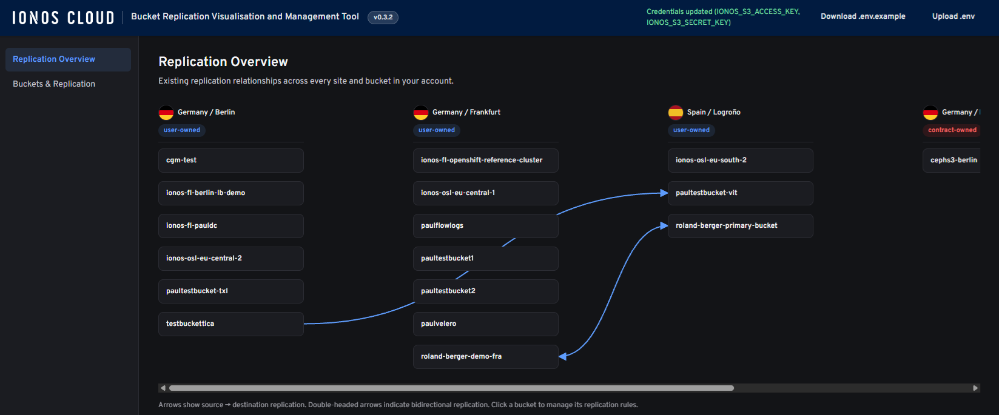

# Bucket Replication Visualisation and Management Tool

A small web app for managing cross-bucket replication on IONOS Object Storage.

- **Server**: Node.js + Express, talks to IONOS's S3-compatible API via `@aws-sdk/client-s3`.
- **Client**: React + Vite SPA.



## Setup

1. Copy `.env.example` to `.env` and fill in your IONOS Object Storage access/secret key
   (Data Center Designer → Object Storage → Key Manager). Alternatively, start the app
   without a `.env` and use the **Upload .env** button in the top banner once it's running —
   the server writes the file and picks up the new credentials immediately, no restart
   needed. **Download .env.example** in the banner gives you the template to fill in.
2. Install dependencies from the repo root (npm workspaces):

   ```
   npm install
   ```

## Run

Start the API server (port 4000 by default):

```
npm run dev
```

In a second terminal, start the client (port 5173):

```
npm run dev:client
```

Open http://localhost:5173. The Vite dev server proxies `/api` requests to the Express
server, so no CORS/URL configuration is needed in development.

## What it does

- **Replication Overview** (landing page): scans every bucket across every IONOS region in
  the account and draws a site/bucket map of existing replication relationships, with
  arrows for one-way replication and double-headed arrows for bidirectional pairs.
- **Buckets & Replication**: browse all buckets, view/enable versioning (required for
  replication), and add, edit, or delete replication rules on a bucket. New rules can
  optionally be made **bidirectional** (only offered when the destination is a user-owned
  bucket, since only user-owned buckets can be a replication source) — this adds a matching
  rule on the destination bucket that points back at the source, via a second API call.

## IONOS-specific rules encoded in this app

- **Only user-owned buckets can be a replication source.** A user-owned bucket may
  replicate to another user-owned bucket or to a contract-owned bucket. Contract-owned
  buckets can't be a source. See `server/src/regions.js` and `BucketDetail.jsx`.
- **Versioning must be enabled on both source and destination** for a replication rule to
  take effect — the UI surfaces this and lets you enable versioning inline.
- **The `Role` field in the replication config is ignored by IONOS** (no IAM roles like
  AWS) — the server sends a placeholder value since the S3 API schema still requires it.
- **`ListBuckets` is shared across all endpoints within an ownership class** — hitting any
  of the three user-owned endpoints (or any of the three contract-owned endpoints) returns
  the same full bucket list. A bucket's true home region is resolved via
  `GetBucketLocation` against one "primary" endpoint per ownership class
  (`server/src/bucketService.js`), not by which endpoint happened to answer.
- **A bucket's replication rules can only target ONE destination bucket** — IONOS rejects
  a `PutBucketReplication` call with `"The destination bucket must be same for all rules"`
  if you try to add a rule pointing somewhere new while an existing rule (to a different
  bucket) is still in place. `BucketDetail.jsx` checks for this before calling the API,
  both when adding a normal rule and when setting up the reverse side of a bidirectional
  pair, so it fails fast with a clear message instead of a confusing server error.
- **Cross-ownership-class replication (user-owned Cloudian → contract-owned Ceph) requires
  Cloudian's proprietary Cross-System Replication (CSR) headers** — plain `PutBucketReplication`
  alone gets rejected with `"No endpoint specified"`, because Cloudian has no routing entry
  for a Ceph-hosted bucket. Per IONOS's internal CSR documentation, the request needs two
  extra headers - `x-gmt-crr-endpoint` (the destination's endpoint URL) and
  `x-gmt-crr-credentials` (`accessKey:secretKey` for the destination) - plus a `Content-MD5`
  of the request body. `server/src/routes/replication.js` (`addCsrHeaders`) attaches these
  automatically via the AWS SDK's command middleware whenever the source is user-owned and
  the destination is contract-owned. CSR is documented as **one-way only** - the bidirectional
  option is only offered when source and destination share the same backend
  (`ReplicationEditor.jsx`).
  - As of this writing, IONOS's account still returns `"Request specifying CRR credentials
    can only be used within a secure request"` even with these headers attached - this looks
    like an infrastructure-side gap (Cloudian checking whether *it* terminated TLS, which its
    edge/load balancer likely does instead) rather than anything fixable client-side. Open
    with IONOS support.
- **Cloudian (user-owned) refuses to configure replication at all on a bucket that has Object
  Lock enabled** — `PutBucketReplication` fails with `"MethodNotAllowed"` (405) regardless of
  destination, confirmed against a real account. Ceph (contract-owned) doesn't have this
  restriction. Not fixable client-side; `BucketDetail.jsx` shows a warning banner in the
  Replication rules section when this applies, and `replication.js` translates the raw 405
  into a clear message rather than the opaque default.

## Regions

Known IONOS Object Storage endpoints are configured in `server/src/regions.js`:

| Code | Ownership | Endpoint |
|---|---|---|
| de | user | s3.eu-central-1.ionoscloud.com |
| eu-central-2 | user | s3.eu-central-2.ionoscloud.com |
| eu-south-2 | user | s3.eu-south-2.ionoscloud.com |
| eu-central-3 | contract | s3.eu-central-3.ionoscloud.com |
| eu-central-4 | contract | s3.eu-central-4.ionoscloud.com |
| us-central-1 | contract | s3.us-central-1.ionoscloud.com |
